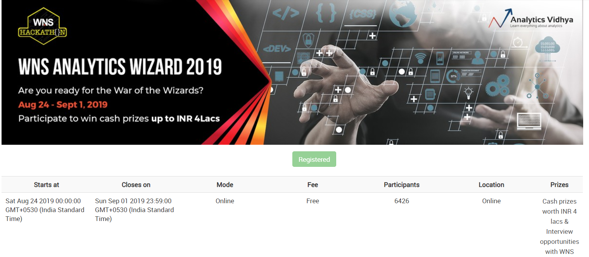
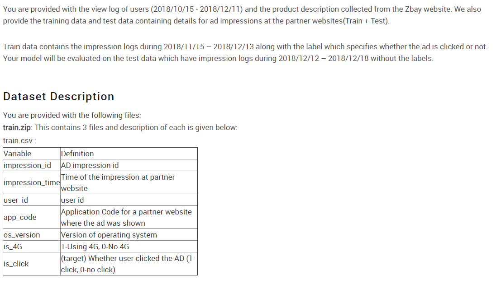

# AV WNS Analytics Wizard 2019

## Note

* **wns.ipynb**
* This Approach scores Private Score of 0.735 AUC and Public Leaderboard Score 0.742 AUC.

# Leaderboard (Nodus Tollens)

* **[Public LB](https://datahack.analyticsvidhya.com/contest/wns-analytics-wizard-2019/lb)** : **76th/836 Rank**
* **[Private LB](https://datahack.analyticsvidhya.com/contest/wns-analytics-wizard-2019/pvt_lb)** : **60th/836 Rank**

(6.5K Participants)
